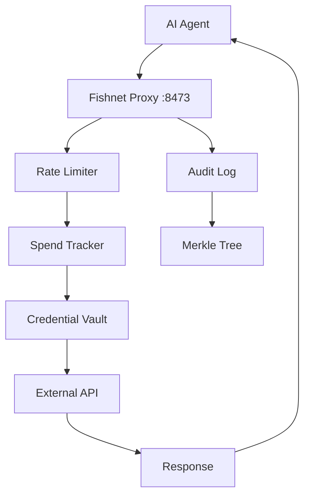

# Architecture

Fishnet is a **local-first security proxy** that sits between your AI agent and the outside world, enforcing security policies without ever sending your credentials or data to external servers.

## Core Design Principles

### Local-First

Everything runs on your machine:
- **Single Rust Binary** — No cloud dependencies, no external API calls for policy enforcement
- **SQLite Storage** — All data (audit logs, credentials, spend tracking) stored locally
- **No Telemetry** — Nothing leaves your machine unless your agent explicitly requests it

### Proxy Model

Fishnet acts as a **man-in-the-middle** between your AI agent and external services:

```
AI Agent → localhost:8473 → Fishnet Proxy → External API
  (untrusted)                (enforces policy)   (internet)
```

Your agent **never sees real credentials**. It only knows `http://localhost:8473/proxy/openai/...`.

## Request Flow

### 1. Agent Makes Request

The agent calls Fishnet's localhost endpoint instead of the real service:

```javascript
// Agent code uses localhost proxy
fetch('http://localhost:8473/proxy/openai/v1/chat/completions', {
  method: 'POST',
  headers: { 'Content-Type': 'application/json' },
  body: JSON.stringify({ model: 'gpt-4', messages: [...] })
})
```

### 2. Policy Enforcement

Fishnet intercepts the request and applies security policies:

<Steps>
  <Step title="Rate Limiting">
    Check if the service has exceeded per-minute request limits
  </Step>
  <Step title="Spend Validation">
    Verify daily budget hasn't been exceeded
  </Step>
  <Step title="Endpoint Blocking">
    Ensure the endpoint isn't on the blocklist (e.g., withdrawals)
  </Step>
  <Step title="LLM Guards">
    Detect prompt drift and oversized prompts (for AI services)
  </Step>
</Steps>

### 3. Credential Injection

If the request passes all checks, Fishnet:

1. **Retrieves encrypted credentials** from the vault
2. **Decrypts** using the master password-derived key
3. **Injects** the real API key into the request headers
4. **Forwards** to the upstream service

From `vault.rs:560-568`:
```rust
let plaintext = Self::decrypt_with_key(
    key.key_array(), 
    &nonce_bytes, 
    &encrypted_key
)?;
let key_str = String::from_utf8(plaintext)
    .map_err(|_| VaultError::InvalidUtf8)?;
```

### 4. Audit Logging

Every decision (approved or denied) is logged in a **tamper-proof Merkle tree**:

```rust
let leaf_hash = merkle::hash_audit_leaf(&leaf_payload);
let root = merkle::insert_leaf_and_new_parents(
    &tx, 
    id, 
    id.saturating_sub(1), 
    leaf_hash
)?;
```

### 5. Response

The upstream response flows back through Fishnet to the agent, unchanged.

## Routing Architecture

Fishnet's Axum router handles three types of routes (from `lib.rs:36-101`):

### Public Routes

```rust
let public_routes = Router::new()
    .route("/api/auth/status", get(auth::status))
    .route("/api/auth/setup", post(auth::setup))
    .route("/api/auth/login", post(auth::login));
```

No authentication required for initial setup and login.

### Protected Routes

```rust
let protected_routes = Router::new()
    .route("/api/status", get(system::status))
    .route("/api/policies", get(system::get_policies).put(system::put_policies))
    .route("/api/credentials", get(vault::list_credentials))
    .route("/api/audit", get(audit::list_audit))
    .layer(axum_middleware::from_fn_with_state(
        state.clone(),
        middleware::require_auth,
    ));
```

Require session authentication for dashboard access.

### Proxy Routes

```rust
let proxy_routes = Router::new()
    .route("/proxy/{provider}/{*rest}", any(proxy::handler))
    .route("/binance/{*rest}", any(proxy::binance_handler))
    .route("/custom/{name}/{*rest}", any(proxy::custom_handler))
    .layer(DefaultBodyLimit::max(constants::MAX_BODY_SIZE));
```

These are the actual proxy endpoints your agent calls.

## Data Flow Diagram



## Storage Architecture

Fishnet uses **SQLite databases** for all persistent state:

| Database | Purpose | Key Features |
|----------|---------|-------------|
| `vault.db` | Encrypted credentials | AES-256-GCM encryption, Argon2id key derivation |
| `spend.db` | Cost tracking, budgets | Daily/monthly limits, per-service tracking |
| `audit.db` | Tamper-proof logs | Merkle tree, cryptographic hashes |
| `auth.db` | User authentication | Bcrypt password hashing |

<Note>
All databases are stored in `/var/lib/fishnet` (Linux) or `~/Library/Application Support/Fishnet` (macOS) by default.
</Note>

## Security Boundaries

### Trust Zones

**Untrusted Zone** (Your AI Agent)
- Has no access to real credentials
- Can only call localhost proxy endpoints
- Cannot bypass Fishnet's policies

**Trusted Zone** (Fishnet Process)
- Holds encrypted credentials in memory
- Enforces all security policies
- Logs every decision

**External Zone** (Internet)
- Receives only approved requests
- Never sees Fishnet's internal state
- Cannot influence policy decisions

### Threat Model

Fishnet protects against:

- **Runaway agent loops** — Spend caps prevent unlimited API usage
- **Credential theft** — Agent never sees real keys
- **Policy bypass** — All requests go through a single enforced choke point
- **Log tampering** — Merkle tree makes modifications detectable

Fishnet does **not** protect against:

- **Compromised host OS** — If your machine is compromised, Fishnet cannot help
- **Malicious policy configuration** — You must configure sane limits
- **Physical access** — Local SQLite files are encrypted at rest only if you use disk encryption

## Performance Characteristics

<Info>
Fishnet adds **minimal latency** to requests:
- Policy checks: < 1ms
- Credential decryption: < 5ms
- Audit logging: < 10ms (async)

Total overhead: ~5-15ms per request.
</Info>

## Next Steps

<CardGroup cols={2}>
  <Card title="Credential Vault" icon="vault" href="/concepts/credential-vault">
    Learn how credentials are encrypted and stored
  </Card>
  <Card title="Spend Limits" icon="dollar-sign" href="/concepts/spend-limits">
    Understand budget enforcement and cost tracking
  </Card>
  <Card title="Rate Limiting" icon="gauge" href="/concepts/rate-limiting">
    See how request throttling works
  </Card>
  <Card title="Audit Trail" icon="list-tree" href="/concepts/audit-trail">
    Explore tamper-proof logging with Merkle trees
  </Card>
</CardGroup>
