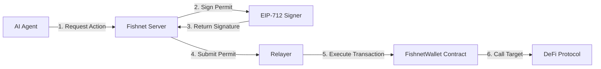

## Overview

Fishnet uses a permit-based smart contract system to enable secure, gasless on-chain actions for AI agents. The core contract, `FishnetWallet`, implements EIP-712 typed structured data signing to authorize transactions without requiring the user to hold ETH for gas.

## Architecture

The FishnetWallet system consists of three key components:



### Components

<CardGroup cols={3}>
  <Card title="FishnetWallet Contract" icon="file-contract">
    On-chain smart contract that validates permits and executes approved actions
  </Card>
  <Card title="Backend Signer" icon="key">
    Rust-based EIP-712 signer that generates cryptographic permits (see `crates/server/src/signer.rs`)
  </Card>
  <Card title="Relayer" icon="satellite-dish">
    Any entity can submit signed permits on-chain, enabling gasless transactions for users
  </Card>
</CardGroup>

## Permit-Based System

### How It Works

1. **User requests an action** through Fishnet (e.g., swap tokens on Uniswap)
2. **Fishnet evaluates the request** against policy rules (spending limits, allowed protocols, etc.)
3. **Backend signs a permit** using EIP-712 structured data signing
4. **Permit is submitted on-chain** by a relayer (user or third-party)
5. **Contract validates the permit** and executes the approved action

### Benefits

<AccordionGroup>
  <Accordion title="Gasless Transactions">
    Users don't need ETH in their wallet. Relayers cover gas costs.
  </Accordion>
  <Accordion title="Policy Enforcement">
    All actions are pre-approved by Fishnet's policy engine before signing
  </Accordion>
  <Accordion title="Decentralized Execution">
    Anyone can relay signed permits—no centralized execution bottleneck
  </Accordion>
  <Accordion title="Cryptographic Security">
    EIP-712 signatures ensure permits cannot be forged or tampered with
  </Accordion>
</AccordionGroup>

## EIP-712 Permit Structure

Each permit authorizes a specific action with precise parameters:

```solidity
struct FishnetPermit {
    address wallet;          // The FishnetWallet contract address
    uint64  chainId;         // Chain ID (prevents replay attacks across chains)
    uint256 nonce;           // Unique nonce (prevents replay attacks)
    uint48  expiry;          // Expiration timestamp (prevents stale permits)
    address target;          // Target contract to call (e.g., Uniswap Router)
    uint256 value;           // ETH value to send
    bytes32 calldataHash;    // Hash of the exact calldata
    bytes32 policyHash;      // Hash of the policy that authorized this action
}
```

### Security Features

- **Nonce-based replay protection**: Each permit can only be used once
- **Chain ID binding**: Permits are valid only on the intended network
- **Expiration timestamps**: Permits automatically expire after a set time
- **Calldata commitment**: The exact transaction data is cryptographically bound to the permit
- **Policy tracking**: Every action is linked to the policy that approved it

## Smart Contract Features

### Core Functions

<CodeGroup>
```solidity execute()
function execute(
    address target,
    uint256 value,
    bytes calldata data,
    FishnetPermit calldata permit,
    bytes calldata signature
) external whenNotPaused;
```

```solidity setSigner()
function setSigner(address _signer) external onlyOwner;
```

```solidity pause() / unpause()
function pause() external onlyOwner;
function unpause() external onlyOwner;
```
</CodeGroup>

### Access Control

- **Owner**: Can update the signer address, pause/unpause the wallet, and withdraw funds
- **Signer**: Backend service that signs permits (can be rotated by owner)
- **Anyone**: Can submit valid signed permits (relayer model)

## Deployment Networks

FishnetWallet is deployed on multiple networks:

<CardGroup cols={2}>
  <Card title="Base Sepolia" icon="vial">
    Testnet for development and testing
    
    Chain ID: `84532`
  </Card>
  <Card title="Base Mainnet" icon="layer-group">
    Production deployment
    
    Chain ID: `8453`
  </Card>
</CardGroup>

Deployment addresses are stored in `contracts/deployments/*.json`.

## Compatibility Testing

The contract includes comprehensive compatibility tests between the Solidity implementation and Rust backend:

- **Typehash matching**: Raw keccak256 of type strings match
- **Domain separator**: Field-by-field EIP-712 domain construction is identical
- **Struct hash encoding**: `abi.encode` padding matches Rust's manual big-endian padding
- **End-to-end flow**: Full sign → verify → execute cycle works correctly
- **Signature format**: `r || s || v` (65 bytes) unpacking is compatible

See `test/EIP712Compatibility.t.sol` for the full test suite.

## Next Steps

<CardGroup cols={2}>
  <Card title="Contract API" icon="code" href="/contracts/fishnet-wallet">
    Explore the full FishnetWallet API, state variables, and events
  </Card>
  <Card title="Deploy Your Own" icon="rocket" href="/contracts/deployment">
    Deploy FishnetWallet to local Anvil, testnets, or mainnet
  </Card>
  <Card title="EIP-712 Permits" icon="signature" href="/contracts/eip712-permits">
    Deep dive into permit structure and signing
  </Card>
  <Card title="Testing" icon="flask" href="/contracts/testing">
    Run the full test suite and verify compatibility
  </Card>
</CardGroup>