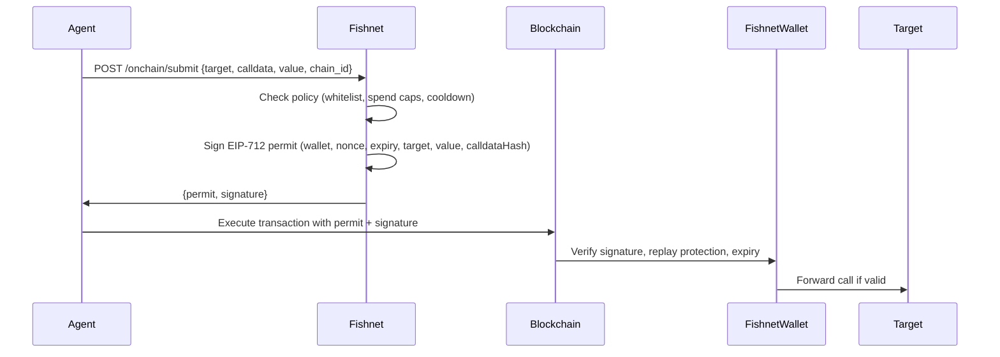

## Overview

Fishnet signs **EIP-712 permits** that authorize on-chain transactions. Instead of exposing raw private keys, agents request permits from Fishnet, which enforces policy limits (spend caps, cooldowns, whitelisted contracts) before signing.

## Architecture



## Configuration

```toml
[onchain]
enabled = true
chain_ids = [1, 8453]  # Ethereum mainnet, Base

[onchain.limits]
max_tx_value_usd = 100.0
daily_spend_cap_usd = 500.0
cooldown_seconds = 300  # 5 minutes between permits
max_slippage_bps = 50   # 0.5%
max_leverage = 3

[onchain.permits]
expiry_seconds = 600  # 10 minutes
require_policy_hash = true
verifying_contract = "0x1234567890123456789012345678901234567890"

# Whitelist: address -> allowed function selectors
[onchain.whitelist]
"0xabcdefabcdefabcdefabcdefabcdefabcdefabcd" = [
  "0xa9059cbb",  # transfer(address,uint256)
  "approve(address,uint256)",  # Text signature (auto-hashed)
]
"0x1111111111111111111111111111111111111111" = [
  "swap(address,address,uint256)",
]
```

**Source**: `~/workspace/source/crates/server/src/onchain.rs:65-165`

## EIP-712 Permit Structure

### Domain

```solidity
EIP712Domain(
  string name,
  string version,
  uint256 chainId,
  address verifyingContract
)
```

- **name**: `"Fishnet"`
- **version**: `"1"`
- **chainId**: From request (e.g., `8453` for Base)
- **verifyingContract**: Contract address from `[onchain.permits]`

**Source**: `~/workspace/source/crates/server/src/signer.rs:129-153`

### Permit Type

```solidity
FishnetPermit(
  address wallet,
  uint64 chainId,
  uint256 nonce,
  uint48 expiry,
  address target,
  uint256 value,
  bytes32 calldataHash,
  bytes32 policyHash
)
```

**Field descriptions**:

- **wallet**: Address of the Fishnet wallet contract (derived from signer)
- **chainId**: Chain ID (must match `chain_ids` allowlist)
- **nonce**: Monotonically increasing nonce (prevents replay)
- **expiry**: Unix timestamp when permit expires (uint48 max: 281474976710655)
- **target**: Contract address to call
- **value**: ETH value to send (in wei, as decimal string)
- **calldataHash**: `keccak256(calldata)`
- **policyHash**: `keccak256(onchain_config_json)` (optional)

**Source**: `~/workspace/source/crates/server/src/signer.rs:18-28`

## Policy Enforcement

Fishnet validates requests against multiple policy rules:

### 1. Chain ID Allowlist

```rust
if config.chain_ids.is_empty() || !config.chain_ids.contains(&req.chain_id) {
    return Err(PolicyDenial {
        reason: format!("chain_id {} not in allowed list", req.chain_id),
        limit: "chain_id".to_string(),
    });
}
```

**Source**: `~/workspace/source/crates/server/src/onchain.rs:71-76`

### 2. Contract Whitelist

Target contract must be in the whitelist:

```rust
let whitelist_entry = config
    .whitelist
    .iter()
    .find(|(addr, _)| addr.to_lowercase() == target_lower);

match whitelist_entry {
    Some((_, selectors)) => selectors,
    None => {
        return Err(PolicyDenial {
            reason: format!("contract {} not in whitelist", req.target),
            limit: "whitelist".to_string(),
        });
    }
}
```

**Source**: `~/workspace/source/crates/server/src/onchain.rs:79-92`

### 3. Function Selector Validation

Calldata must call an allowed function:

```rust
let fn_selector = &calldata_hex[..8];
let selector_matches = allowed_selectors.iter().any(|sel| {
    let sel_trimmed = sel.strip_prefix("0x").unwrap_or(sel);
    if sel_trimmed.len() == 8 && sel_trimmed.chars().all(|c| c.is_ascii_hexdigit()) {
        // Exact 4-byte selector match
        sel_trimmed.to_lowercase() == fn_selector.to_lowercase()
    } else {
        // Text signature: hash to selector
        let hash = Keccak256::digest(sel.as_bytes());
        let computed = hex::encode(&hash[..4]);
        computed == fn_selector.to_lowercase()
    }
});
```

**Source**: `~/workspace/source/crates/server/src/onchain.rs:94-117`

<Note>
  You can specify selectors as either:
  - **4-byte hex**: `"0xa9059cbb"`
  - **Text signature**: `"transfer(address,uint256)"` (auto-hashed to selector)
</Note>

### 4. Transaction Value Limit

```rust
if config.limits.max_tx_value_usd > 0.0 {
    let tx_value: f64 = req.value.parse().unwrap_or(0.0);
    if tx_value > config.limits.max_tx_value_usd {
        return Err(PolicyDenial {
            reason: format!(
                "tx value {} exceeds max_tx_value_usd {}",
                tx_value, config.limits.max_tx_value_usd
            ),
            limit: "max_tx_value_usd".to_string(),
        });
    }
}
```

**Source**: `~/workspace/source/crates/server/src/onchain.rs:124-135`

### 5. Daily Spend Cap

```rust
if config.limits.daily_spend_cap_usd > 0.0 {
    let tx_value: f64 = req.value.parse().unwrap_or(0.0);
    if onchain_spent_today + tx_value > config.limits.daily_spend_cap_usd {
        return Err(PolicyDenial {
            reason: format!(
                "daily spend would exceed cap: {:.2} + {:.2} > {:.2}",
                onchain_spent_today, tx_value, config.limits.daily_spend_cap_usd
            ),
            limit: "daily_spend_cap_usd".to_string(),
        });
    }
}
```

**Source**: `~/workspace/source/crates/server/src/onchain.rs:137-148`

### 6. Cooldown Period

```rust
if config.limits.cooldown_seconds > 0 {
    let now = chrono::Utc::now().timestamp();
    let elapsed = now - last_permit_at;
    if last_permit_at > 0 && elapsed < config.limits.cooldown_seconds as i64 {
        return Err(PolicyDenial {
            reason: format!(
                "cooldown active: {}s remaining",
                config.limits.cooldown_seconds as i64 - elapsed
            ),
            limit: "cooldown".to_string(),
        });
    }
}
```

**Source**: `~/workspace/source/crates/server/src/onchain.rs:150-163`

## Signing Process

<Steps>
  <Step title="Generate nonce">
    Fishnet reads the next sequential nonce from the database:
    ```rust
    let nonce = state.spend_store.next_nonce().await?;
    ```
  </Step>
  <Step title="Hash calldata">
    ```rust
    let calldata_bytes = hex::decode(req.calldata.strip_prefix("0x").unwrap_or(&req.calldata))?;
    let calldata_hash = Keccak256::digest(&calldata_bytes);
    let calldata_hash_hex = format!("0x{}", hex::encode(calldata_hash));
    ```
  </Step>
  <Step title="Compute policy hash (optional)">
    If `require_policy_hash = true`, hash the onchain config:
    ```rust
    let policy_data = serde_json::to_string(&config.onchain)?;
    let policy_hash = format!("0x{}", hex::encode(Keccak256::digest(policy_data.as_bytes())));
    ```
  </Step>
  <Step title="Sign EIP-712 digest">
    Fishnet computes the EIP-712 typed data hash and signs with secp256k1:
    ```rust
    let signature = state.signer.sign_permit(&permit).await?;
    ```
    Returns 65-byte signature: `r || s || v`
  </Step>
  <Step title="Record permit">
    Permit details are saved to the database for audit and nonce tracking:
    ```rust
    state.spend_store.record_permit(&PermitEntry {
        chain_id: req.chain_id,
        target: &req.target,
        value: &req.value,
        status: "approved",
        permit_hash: Some(&permit_hash_str),
        cost_usd: tx_value,
    }).await?;
    ```
  </Step>
</Steps>

**Source**: `~/workspace/source/crates/server/src/onchain.rs:337-468`

## API Usage

### Request Permit

```bash
curl -X POST http://localhost:3000/onchain/submit \
  -H "Content-Type: application/json" \
  -d '{
    "target": "0xabcdefabcdefabcdefabcdefabcdefabcdefabcd",
    "calldata": "0xa9059cbb000000000000000000000000111111111111111111111111111111111111111100000000000000000000000000000000000000000000000000000000000003e8",
    "value": "0",
    "chain_id": 8453
  }'
```

### Response (Approved)

```json
{
  "status": "approved",
  "permit": {
    "wallet": "0x70997970c51812dc3a010c7d01b50e0d17dc79c8",
    "chainId": 8453,
    "nonce": 1,
    "expiry": 1700000600,
    "target": "0xabcdefabcdefabcdefabcdefabcdefabcdefabcd",
    "value": "0",
    "calldataHash": "0xd4fd4e189132273036449fc9e11198c739161b4c0116a9a2dccdfa1c492006f1",
    "policyHash": "0xb2590ce26adfc7f2814ca4b72880660e2369b23d16ffb446362696d8186d6348",
    "verifyingContract": "0x1234567890123456789012345678901234567890"
  },
  "signature": "0xabcdef...6789012345"
}
```

### Response (Denied)

```json
{
  "status": "denied",
  "reason": "contract 0x9999... not in whitelist",
  "limit": "whitelist"
}
```

## Smart Contract Integration

Fishnet is compatible with the `FishnetWallet` smart contract:

**Contract source**: `~/workspace/source/contracts/src/FishnetWallet.sol`

### Deployment

```bash
cd contracts
SIGNER_ADDRESS=0x70997970C51812dc3A010C7d01b50e0d17dc79C8 \
  forge script script/Deploy.s.sol:DeployFishnetWallet \
  --rpc-url https://sepolia.base.org \
  --broadcast \
  --verify
```

**Deployment guide**: `~/workspace/source/contracts/README.md:33-61`

### Executing Permits On-Chain

The smart contract verifies:

1. **Signature recovery**: Signer address must match `signerAddress` state variable
2. **Nonce uniqueness**: Prevents replay attacks
3. **Expiry**: `block.timestamp <= permit.expiry`
4. **Chain ID**: `permit.chainId == block.chainid`
5. **Calldata hash**: Recomputed from provided calldata must match `permit.calldataHash`

If all checks pass, the contract forwards the call to `permit.target` with `permit.value`.

**Contract verification tests**: `~/workspace/source/contracts/test/EIP712Compatibility.t.sol`

## Nonce Management

Fishnet maintains a global nonce counter in SQLite:

```sql
CREATE TABLE IF NOT EXISTS onchain_nonces (
  id INTEGER PRIMARY KEY,
  current_nonce INTEGER NOT NULL DEFAULT 0
);
```

Each permit increments the nonce atomically:

```rust
pub async fn next_nonce(&self) -> Result<u64> {
    let conn = self.pool.get()?;
    conn.execute(
        "INSERT INTO onchain_nonces (id, current_nonce) VALUES (1, 1)
         ON CONFLICT(id) DO UPDATE SET current_nonce = current_nonce + 1",
        [],
    )?;
    
    let nonce: i64 = conn.query_row(
        "SELECT current_nonce FROM onchain_nonces WHERE id = 1",
        [],
        |row| row.get(0),
    )?;
    
    Ok(nonce as u64)
}
```

<Warning>
  **Multi-instance deployments**: If running multiple Fishnet instances, they must share the same SQLite database (via network filesystem) to avoid nonce conflicts.
</Warning>

## Permit Expiry

```rust
let now = chrono::Utc::now().timestamp() as u64;
let expiry = now + config.onchain.permits.expiry_seconds;
```

Default: 600 seconds (10 minutes)

Permits are valid for a limited time window. If the on-chain transaction is not submitted before expiry, the permit becomes invalid and a new one must be requested.

**Validation**:

```rust
if self.expiry > UINT48_MAX {
    return Err(SignerError::InvalidPermit(
        format!("expiry {} exceeds uint48 max ({})", self.expiry, UINT48_MAX)
    ));
}
```

**Source**: `~/workspace/source/crates/server/src/signer.rs:53-60`

## Monitoring

### Get Onchain Stats

```bash
curl http://localhost:3000/onchain/stats
```

```json
{
  "total_permits_signed": 42,
  "total_permits_denied": 5,
  "spent_today_usd": 127.50,
  "last_permit_at": 1700000123
}
```

### List Recent Permits

```bash
curl "http://localhost:3000/onchain/permits?days=7&status=approved"
```

```json
{
  "permits": [
    {
      "timestamp": 1700000123,
      "chain_id": 8453,
      "target": "0xabcd...",
      "value": "0",
      "status": "approved",
      "permit_hash": "0xdef0...",
      "cost_usd": 0.0
    }
  ]
}
```

**Source**: `~/workspace/source/crates/server/src/onchain.rs:740-757`

## Security Considerations

<Warning>
  **Permit reuse**: Nonces prevent replay attacks, but if the signer private key is compromised, an attacker could sign arbitrary permits.
  
  **Mitigation**: Use hardware wallets or HSMs for production signer keys.
</Warning>

<Note>
  **Policy hash enforcement**: If `require_policy_hash = true`, the smart contract can verify that the permit was signed under a specific policy configuration.
</Note>

## Next Steps

<CardGroup cols={2}>
  <Card title="ZK Proofs" icon="fingerprint" href="/security/zk-proofs">
    Generate Merkle proofs for compliance attestation
  </Card>
  <Card title="Prompt Drift Detection" icon="shield-halved" href="/security/prompt-drift-detection">
    Detect prompt injection attacks
  </Card>
</CardGroup>
