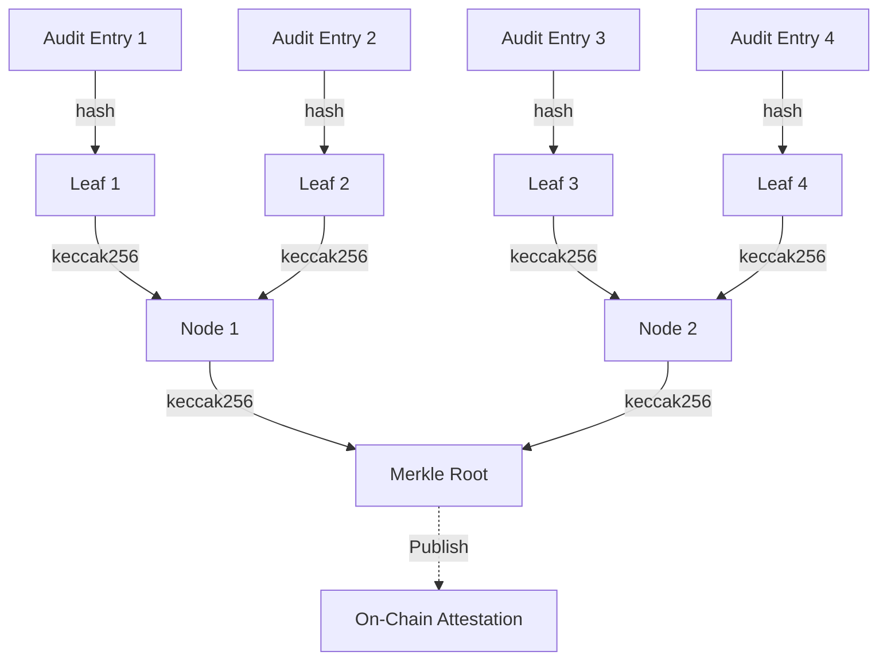

## Overview

Fishnet builds a **Merkle tree** from every audit entry, allowing you to generate cryptographic proofs that a specific decision was made without revealing the entire audit log. This enables:

- **Privacy-preserving compliance**: Prove an action was approved without exposing other requests
- **Tamper-evident audit trails**: Merkle root changes if any entry is modified
- **Selective disclosure**: Share proofs for specific entries while keeping others private

## Architecture



## How It Works

### 1. Leaf Hashing

Each audit entry is hashed using Keccak256:

```rust
pub fn hash_audit_leaf(payload: &LeafPayload<'_>) -> H256 {
    let mut bytes = Vec::with_capacity(512);
    bytes.extend_from_slice(&payload.id.to_le_bytes());
    bytes.extend_from_slice(&payload.timestamp.to_le_bytes());
    push_string(&mut bytes, payload.intent_type);
    push_string(&mut bytes, payload.service);
    push_string(&mut bytes, payload.action);
    push_string(&mut bytes, payload.decision);

    match payload.reason {
        Some(reason) => {
            bytes.push(1);
            push_string(&mut bytes, reason);
        }
        None => bytes.push(0),
    }

    // Cost in microdollars (i64)
    match payload.cost_usd {
        Some(cost) if cost.is_finite() && cost >= 0.0 => {
            bytes.push(1);
            let micros = (cost * 1_000_000.0).round() as i64;
            bytes.extend_from_slice(&micros.to_le_bytes());
        }
        _ => bytes.push(0),
    }

    bytes.extend_from_slice(&payload.policy_version_hash);
    bytes.extend_from_slice(&payload.intent_hash);

    if let Some(hash) = payload.permit_hash {
        bytes.push(1);
        bytes.extend_from_slice(&hash);
    } else {
        bytes.push(0);
    }

    keccak256(&bytes)
}
```

**Source**: `~/workspace/source/crates/server/src/audit/merkle.rs:58-96`

### 2. Tree Construction

Leaves are paired and hashed recursively:

```rust
pub fn compute_root_from_hashes(mut layer: Vec<H256>) -> H256 {
    if layer.is_empty() {
        return ZERO_H256;
    }

    while layer.len() > 1 {
        if layer.len() % 2 == 1 {
            let last = *layer.last().unwrap_or(&ZERO_H256);
            layer.push(last);  // Duplicate last leaf for odd count
        }

        let mut next_layer = Vec::with_capacity(layer.len() / 2);
        for pair in layer.chunks_exact(2) {
            next_layer.push(hash_pair(&pair[0], &pair[1]));
        }
        layer = next_layer;
    }

    layer[0]  // Root
}
```

**Source**: `~/workspace/source/crates/server/src/audit/merkle.rs:150-169`

### 3. Proof Generation

For a given leaf, collect sibling hashes along the path to the root:

```rust
pub fn merkle_path_for_leaf(conn: &Connection, leaf_position: u64) -> Vec<H256> {
    let mut layer = load_leaf_hashes(conn)?;
    let mut index = leaf_position as usize;
    let mut path = Vec::new();

    while layer.len() > 1 {
        if layer.len() % 2 == 1 {
            let last = *layer.last().unwrap_or(&ZERO_H256);
            layer.push(last);
        }

        let sibling = if index % 2 == 0 { index + 1 } else { index - 1 };
        path.push(layer[sibling]);

        let mut next_layer = Vec::with_capacity(layer.len() / 2);
        for pair in layer.chunks_exact(2) {
            next_layer.push(hash_pair(&pair[0], &pair[1]));
        }

        layer = next_layer;
        index /= 2;
    }

    Ok(path)
}
```

**Source**: `~/workspace/source/crates/server/src/audit/merkle.rs:171-203`

## API Usage

### Get Merkle Root

```bash
curl http://localhost:3000/api/audit/merkle/root
```

```json
{
  "root": "0xabcdef1234567890abcdef1234567890abcdef1234567890abcdef1234567890",
  "leaf_count": 127,
  "last_entry_id": 127
}
```

### Generate Proof for Entry

```bash
curl http://localhost:3000/api/audit/merkle/proof/42
```

```json
{
  "entry_id": 42,
  "leaf_hash": "0x123abc...",
  "proof": [
    "0x456def...",
    "0x789012...",
    "0xabcdef..."
  ],
  "root": "0xabcdef1234567890abcdef1234567890abcdef1234567890abcdef1234567890"
}
```

### Verify Proof (Off-Chain)

To verify a proof:

1. Hash the leaf using `hash_audit_leaf()`
2. Traverse the proof path, hashing pairs:
   ```rust
   let mut current = leaf_hash;
   for sibling in proof {
       current = if index % 2 == 0 {
           hash_pair(&current, &sibling)
       } else {
           hash_pair(&sibling, &current)
       };
       index /= 2;
   }
   assert_eq!(current, expected_root);
   ```

## Database Schema

### Merkle Nodes Table

```sql
CREATE TABLE audit_merkle_nodes (
  entry_id INTEGER NOT NULL,
  level INTEGER NOT NULL,
  position INTEGER NOT NULL,
  is_leaf INTEGER NOT NULL,
  hash BLOB NOT NULL,
  PRIMARY KEY (level, position)
);
```

**Columns**:

- **entry_id**: Audit entry ID that caused this node to be updated
- **level**: Tree level (0 = leaves, max = root)
- **position**: Position at this level (0-indexed)
- **is_leaf**: 1 if leaf node, 0 if internal node
- **hash**: 32-byte Keccak256 hash

**Source**: `~/workspace/source/crates/server/src/audit/merkle.rs:98-144`

### Incremental Updates

When a new audit entry is added:

```rust
let leaf_hash = hash_audit_leaf(&leaf_payload);
let root = insert_leaf_and_new_parents(conn, entry_id, leaf_position, leaf_hash)?;
```

This:

1. Inserts the leaf node at level 0
2. Recomputes parent nodes up to the root
3. Updates only affected nodes (O(log n) writes)

**Source**: `~/workspace/source/crates/server/src/audit/merkle.rs:98-144`

## On-Chain Attestation

Publish Merkle roots on-chain for tamper-proof timestamping:

<Steps>
  <Step title="Deploy attestation contract">
    ```solidity
    contract FishnetAttestation {
        mapping(uint256 => bytes32) public roots;
        uint256 public latestEpoch;
        
        function submitRoot(bytes32 root) external onlyOwner {
            latestEpoch++;
            roots[latestEpoch] = root;
            emit RootSubmitted(latestEpoch, root, block.timestamp);
        }
    }
    ```
  </Step>
  <Step title="Fetch current root">
    ```bash
    curl http://localhost:3000/api/audit/merkle/root
    ```
  </Step>
  <Step title="Submit to contract">
    ```bash
    cast send 0xContractAddress "submitRoot(bytes32)" \
      0xabcdef... \
      --rpc-url https://base.sepolia.org \
      --private-key $OWNER_KEY
    ```
  </Step>
  <Step title="Verify on-chain">
    ```bash
    cast call 0xContractAddress "roots(uint256)" 1 \
      --rpc-url https://base.sepolia.org
    ```
  </Step>
</Steps>

## Use Cases

### 1. Compliance Proof

**Scenario**: An auditor requests proof that a specific transaction was approved.

**Solution**:

1. Generate proof for the relevant audit entry
2. Share proof + leaf data (without revealing other entries)
3. Auditor verifies proof against published on-chain root

### 2. Tamper Detection

**Scenario**: Verify audit log integrity after a security incident.

**Solution**:

1. Fetch current Merkle root from database
2. Compare to previously published on-chain root
3. If roots differ, audit log has been tampered with

### 3. Selective Disclosure

**Scenario**: Prove a high-value transaction was denied without exposing other requests.

**Solution**:

1. Filter audit log for the specific entry
2. Generate proof for that entry
3. Share proof + minimal entry metadata (timestamp, decision, action)
4. Verifier confirms the entry exists in the committed tree

## Cryptographic Details

### Hash Function

Fishnet uses **Keccak256** (the Ethereum-compatible SHA-3 variant):

```rust
use tiny_keccak::{Hasher, Keccak};

pub fn keccak256(data: &[u8]) -> H256 {
    let mut hasher = Keccak::v256();
    hasher.update(data);
    let mut out = [0u8; 32];
    hasher.finalize(&mut out);
    out
}
```

**Source**: `~/workspace/source/crates/server/src/audit/merkle.rs:24-30`

### Leaf Encoding

Leaves are encoded as:

```
id (8 bytes, LE) ||
timestamp (8 bytes, LE) ||
length(intent_type) (8 bytes, LE) || intent_type ||
length(service) (8 bytes, LE) || service ||
length(action) (8 bytes, LE) || action ||
length(decision) (8 bytes, LE) || decision ||
reason_present (1 byte) || [length(reason) || reason] ||
cost_present (1 byte) || [cost_micros (8 bytes, LE)] ||
policy_version_hash (32 bytes) ||
intent_hash (32 bytes) ||
permit_hash_present (1 byte) || [permit_hash (32 bytes)]
```

Strings are length-prefixed (8-byte little-endian length + UTF-8 bytes).

**Source**: `~/workspace/source/crates/server/src/audit/merkle.rs:58-96`

### Pair Hashing

```rust
pub fn hash_pair(left: &H256, right: &H256) -> H256 {
    let mut bytes = [0u8; 64];
    bytes[..32].copy_from_slice(left);
    bytes[32..].copy_from_slice(right);
    keccak256(&bytes)
}
```

**Source**: `~/workspace/source/crates/server/src/audit/merkle.rs:32-37`

<Warning>
  **Determinism**: Pair order matters. Fishnet always hashes `(left, right)` based on tree position, ensuring deterministic root computation.
</Warning>

## Performance

### Tree Height

```rust
fn tree_height_for_leaf_count(leaf_count: u64) -> u32 {
    if leaf_count <= 1 {
        0
    } else {
        u64::BITS - (leaf_count - 1).leading_zeros()
    }
}
```

For N leaves:
- **Height**: ⌈log₂(N)⌉
- **Proof size**: ⌈log₂(N)⌉ hashes (32 bytes each)
- **Verification cost**: O(log N) hash operations

**Examples**:
- 1,000 entries → ~10 proof hashes (320 bytes)
- 1,000,000 entries → ~20 proof hashes (640 bytes)

**Source**: `~/workspace/source/crates/server/src/audit/merkle.rs:282-288`

### Incremental Updates

Only O(log N) nodes are updated when adding a new leaf:

```rust
let mut current_hash = leaf_hash;
let mut current_level = 0u32;
let target_height = tree_height_for_leaf_count(leaf_position.saturating_add(1));

while current_level < target_height {
    let sibling_hash = get_node_hash(conn, current_level, sibling_position)?
        .unwrap_or(current_hash);
    
    let parent_hash = hash_pair(&left, &right);
    current_level += 1;
    current_position /= 2;
    
    insert_node(conn, entry_id, current_level, current_position, false, &parent_hash)?;
    current_hash = parent_hash;
}
```

**Source**: `~/workspace/source/crates/server/src/audit/merkle.rs:98-144`

## Integration Example

### Automated Root Publishing

```python
import requests
import time
from web3 import Web3

FISHNET_URL = "http://localhost:3000"
CONTRACT_ADDRESS = "0x1234..."
RPC_URL = "https://base.sepolia.org"

w3 = Web3(Web3.HTTPProvider(RPC_URL))
contract = w3.eth.contract(address=CONTRACT_ADDRESS, abi=[...])

def publish_root():
    # Fetch current Merkle root
    resp = requests.get(f"{FISHNET_URL}/api/audit/merkle/root")
    data = resp.json()
    root = data["root"]
    leaf_count = data["leaf_count"]
    
    # Submit to smart contract
    tx = contract.functions.submitRoot(
        bytes.fromhex(root[2:]),  # Strip 0x prefix
        leaf_count
    ).build_transaction({
        "from": OWNER_ADDRESS,
        "nonce": w3.eth.get_transaction_count(OWNER_ADDRESS),
    })
    
    signed = w3.eth.account.sign_transaction(tx, OWNER_KEY)
    tx_hash = w3.eth.send_raw_transaction(signed.rawTransaction)
    
    print(f"Published root {root} (leaves: {leaf_count}) in tx {tx_hash.hex()}")

# Run every hour
while True:
    publish_root()
    time.sleep(3600)
```

## Testing

Fishnet includes comprehensive Merkle tree tests:

```bash
cd ~/workspace/source/crates/server
cargo test merkle
```

**Test coverage**:

- **Stability**: Same input produces same hash
- **Collision resistance**: Different inputs produce different hashes
- **Proof verification**: Generated proofs validate correctly
- **Incremental updates**: Tree remains consistent after insertions

**Source**: `~/workspace/source/crates/server/src/audit/merkle.rs:301-346`

## Security Considerations

<Warning>
  **Root publication frequency**: Publishing roots too frequently increases gas costs. Publishing too infrequently reduces auditability.
  
  **Recommendation**: Publish roots every 1-24 hours based on your compliance requirements.
</Warning>

<Note>
  **Proof size**: For very large audit logs (>1M entries), proof sizes remain manageable (~640 bytes). However, on-chain verification costs scale with proof length.
</Note>

## Next Steps

<CardGroup cols={2}>
  <Card title="Prompt Drift Detection" icon="shield-halved" href="/security/prompt-drift-detection">
    Detect unauthorized prompt modifications
  </Card>
  <Card title="Endpoint Blocking" icon="ban" href="/security/endpoint-blocking">
    Block dangerous API endpoints
  </Card>
</CardGroup>
